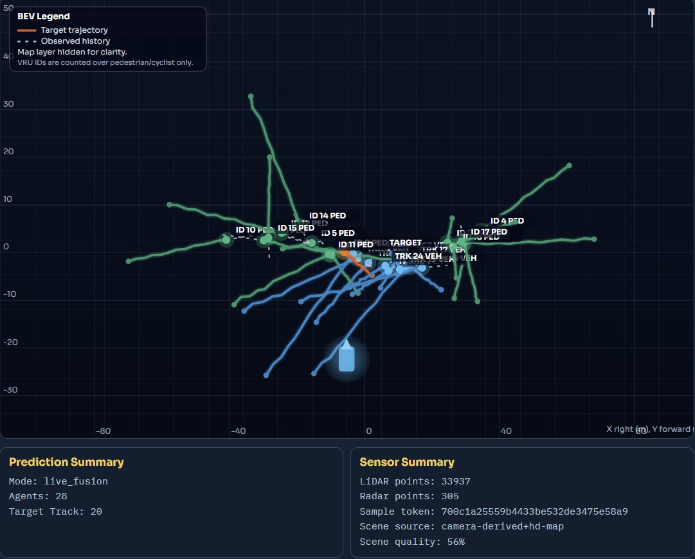
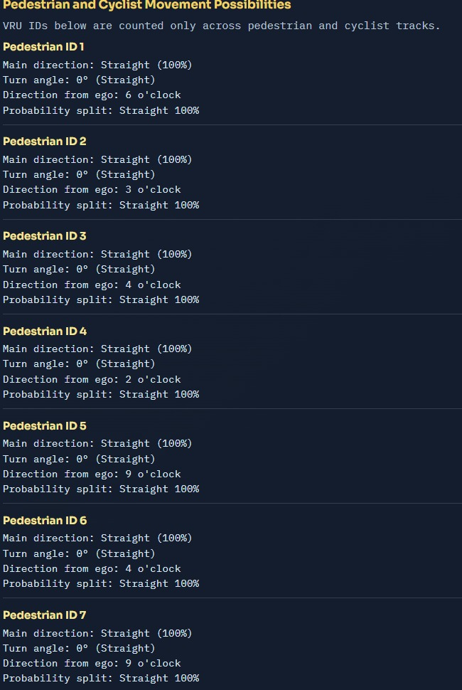
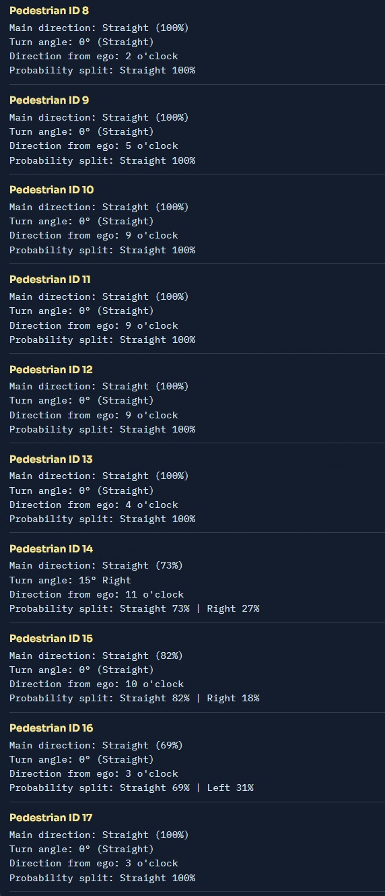
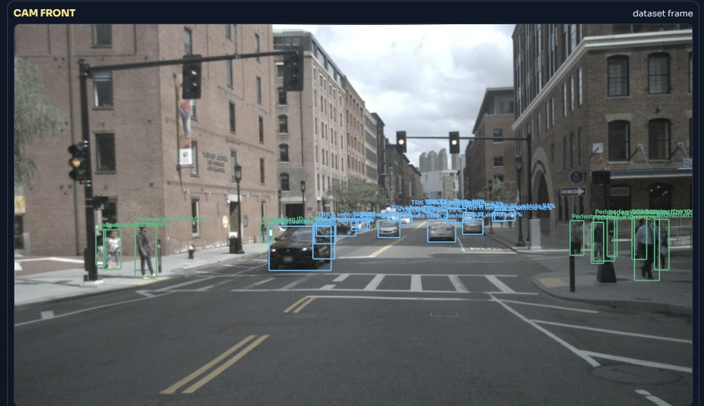

# IntentDrive — BEV Vulnerable Road User Trajectory Prediction

An end-to-end Bird's-Eye-View (BEV) trajectory forecasting system for vulnerable road users (VRUs). The system connects camera-based perception, lightweight multi-agent tracking, and a transformer-based social forecasting model through a structured FastAPI backend and a React visualization dashboard.

> **Competition:** Computer Vision Challenge — AI and Computer Vision Track
> **Team:** 4% | **Lead:** Sajith J | **Institution:** Sri Shakthi Institute of Engineering & Technology

---

## Problem Statement

In Level 4 autonomous driving, reacting to the *current* position of pedestrians and cyclists is insufficient. VRUs can behave unpredictably and may be occluded behind vehicles or other objects. This project builds a system that uses **2 seconds of past motion history** to predict the **next 6 seconds of future trajectory**, enabling safer and more proactive decisions.

> **"Math over Pixels"** — our deliberate architectural decision. Rather than relying purely on visual signals, we model the underlying kinematics and social interactions of agents, making the system robust to occlusion and poor lighting.

Real-world context: A Waymo robotaxi struck a child near Grant Elementary School in Santa Monica on January 23, 2026, causing minor injuries. Systems like IntentDrive are designed to anticipate such scenarios before they occur.

---

## Project Overview

This project addresses the problem of safety-critical motion forecasting for pedestrians, cyclists, and motorcyclists in autonomous driving scenarios. Given a short observed history of agent positions, the system predicts **K=3 multimodal 6-second future trajectories** (12 future steps) along with per-mode probability scores.

The full pipeline includes:

- Object detection and optional keypoint extraction from camera frames
- Image-to-BEV coordinate conversion using camera intrinsics and scene geometry
- Temporal tracking to build per-agent motion histories
- Social context construction from neighboring agent tracks within a **50-meter radius**
- Transformer-based trajectory forecasting with goal-conditioned multimodal decoding
- LiDAR and radar fusion for improved short-term kinematic estimation
- FastAPI backend serving inference, live frame access, and health endpoints
- React + TypeScript dashboard for BEV scene visualization, trajectory rendering, and sensor overlay

---

## System Architecture

The pipeline operates across five stages:

**Stage 1 — Data Ingestion & Preprocessing**
Multi-sensor input (6x cameras, LiDAR_TOP, 5x radar channels) is ingested from nuScenes. Timestamps are synchronized via sample-token matching. All sensor readings are projected into a unified ego-centric BEV coordinate frame using sensor-to-ego calibration matrices and quaternion-to-yaw conversion.

**Stage 2 — Feature Extraction**
Three parallel branches process sensor data simultaneously:
- **Camera branch:** Faster R-CNN (ResNet50-FPN) for multi-class object detection + Keypoint R-CNN for 17-point human pose estimation
- **LiDAR branch:** Occupancy and depth geometry extraction
- **Radar branch:** Velocity vectors and Doppler motion cues

**Stage 3 — Fusion & Tracking**
Cross-sensor fusion combines semantic detections, spatial geometry, and motion dynamics into unified agent representations. Multi-object tracking maintains consistent IDs across frames using nearest-neighbor IoU matching with pixel gating. Motion encoding builds a 4-step history of (x, y, velocity_x, velocity_y, speed, heading_sin, heading_cos) per agent.

**Stage 4 — Model Inference**
A goal-conditioned Trajectory Transformer with social attention predicts 3 trajectory modes, each 12 steps (6 seconds) into the future. Post-processing assigns direction labels (Straight / Left / Right / Backward) and top-3 probabilities per VRU.

**Stage 5 — Deployment & Visualization**
Outputs include camera overlay with bounding boxes and skeleton paths, a holographic skeleton panel for explainability, and a fused BEV map with direction probabilities.

---

## Model Architecture

### Base Model: TrajectoryTransformer

The base model (`backend/app/ml/model.py`) is a goal-conditioned multimodal trajectory forecaster operating on 4-step observed windows with 7 features per timestep: x, y, velocity_x, velocity_y, speed, heading_sin, heading_cos.

**Components:**

| Component | Description |
|---|---|
| Feature Embedding | Linear projection from 7 input features to d_model=64 |
| Positional Encoding | Sinusoidal positional encoding over the observed sequence |
| Temporal Encoder | 2-layer TransformerEncoder, 4 attention heads, feedforward dim 256 |
| Social Attention | Multi-head attention pooling over encoded neighbor agent representations, 4 heads |
| Goal Head | MLP predicting K=3 distinct 2D endpoint goals from the combined context |
| Trajectory Head | MLP conditioned on context + each predicted goal; outputs a 12-step path per mode |
| Probability Head | Linear layer with softmax producing per-mode confidence scores |

**Forward pass summary:**

1. Each agent's 4-step observed sequence is embedded and positionally encoded.
2. The TransformerEncoder produces a context vector from the final timestep.
3. Each neighboring agent within the social radius is independently encoded and pooled into a social context vector via cross-attention.
4. Target and social context vectors are concatenated to form a 128-dimensional hidden state.
5. K=3 goal endpoints are predicted from the hidden state.
6. Each goal is concatenated back to the hidden state to condition the trajectory decoder, producing 3 independent 12-step trajectory modes.
7. Mode probabilities are produced via a linear + softmax head.

**Loss function:**

The training objective combines four terms:

- Best-of-K trajectory loss (minimum L2 error over K modes)
- Goal loss (L2 distance from the best-mode predicted endpoint to ground truth endpoint)
- Probability cross-entropy loss (supervising the mode probability head)
- Diversity regularization loss (penalizes mode collapse via exponential repulsion between modes)

### Fusion Model: TrajectoryTransformerFusion

The fusion variant (`backend/app/ml/model_fusion.py`) extends the base model with a sensor-aware input branch. In addition to the standard 7-feature kinematic input, per-timestep fusion features of dimension 3 are accepted: normalized LiDAR point count, normalized radar point count, and composite sensor strength. These fusion features are projected to d_model=64 via a separate linear layer, added to the base kinematic embedding, and normalized with LayerNorm before entering the shared TransformerEncoder. The fusion model supports loading weights from a base model checkpoint for initialization.

---

## Dataset

**Source:** nuScenes mini split (V1.0-mini), annotations loaded via nuScenes JSON tables. The model was trained and evaluated exclusively using the provided dataset, without incorporating any external data sources.

**Target classes:** pedestrian, bicycle, motorcycle

**Sensors used:** 6x cameras, LIDAR_TOP, 5x radar channels

**Windowing:**
- Takes a **2-second history** of motion as input (4 observed steps at 2 Hz)
- Outputs **K=3 multimodal trajectory predictions over a 6-second prediction horizon** (12 future steps at 2 Hz), each with an associated probability score

**Input features per observed step:**
- x, y position (BEV meters)
- velocity_x, velocity_y (m/s)
- speed (m/s)
- heading_sin, heading_cos (unit circle encoding)

**Social context radius:** 50 meters

**Data augmentation (training split only):** random rotation, horizontal reflection, Gaussian coordinate noise injection

**Split protocol:** deterministic 80/20 train/validation split (seed 42)

---

## Performance

### Baseline: Constant-Velocity Model

| Metric | Value |
|---|---|
| minADE (K=3) | 0.65 m |
| minFDE (K=3) | 1.35 m |
| Miss Rate (>2.0 m) | 19.9 % |

### Base Model — Camera-Only Transformer (best_social_model.pth)

| Metric | Value | Improvement vs Baseline |
|---|---|---|
| Validation trajectories | 468 | — |
| minADE (K=3) | 0.50 m | 23.1% |
| minFDE (K=3) | 0.96 m | 29.6% |
| Miss Rate (>2.0 m) | 9.9 % | 50.8% |

### Fusion Model — LiDAR + Radar (best_social_model_fusion.pth)

| Metric | Value | Improvement vs Baseline |
|---|---|---|
| Validation trajectories | 468 | — |
| minADE (K=3) | **0.42 m** | **35.4%** |
| minFDE (K=3) | **0.78 m** | **42.2%** |
| Miss Rate (>2.0 m) | **7.1 %** | **64.3%** |

### Runtime Benchmark

| Stage | Latency |
|---|---|
| Detection model — Faster R-CNN (per frame) | 42 ms |
| Sensor fusion — LiDAR + Radar lookup | 16 ms |
| Transformer prediction head (per agent) | 18.6 ms |
| Full end-to-end pipeline (2-frame loop) | ~137.3 ms |
| Equivalent throughput | ~7.28 FPS |

### Model Efficiency

| Model | Parameters | Size |
|---|---|---|
| Base Transformer | ~146K | ~0.6 MB |
| Fusion Transformer | ~146K | ~0.6 MB |

The prediction module is compact and edge-friendly. The real-time bottleneck comes from the heavy CNN perception stack (Faster R-CNN), not the trajectory prediction head.

---

## Repository Structure

```
bev/
├── backend/
│   ├── app/
│   │   ├── api/
│   │   │   └── routes/          # FastAPI route modules: health, live, predict
│   │   ├── core/                # Serialization and shared utilities
│   │   ├── ml/
│   │   │   ├── model.py         # TrajectoryTransformer (base, camera-only)
│   │   │   ├── model_fusion.py  # TrajectoryTransformerFusion (LiDAR + Radar)
│   │   │   ├── inference.py     # Inference pipeline
│   │   │   └── sensor_fusion.py # LiDAR/radar feature extraction
│   │   ├── services/            # Business logic layer
│   │   └── main.py              # FastAPI application factory
│   └── scripts/
│       ├── data/                # Dataset construction from nuScenes images
│       ├── training/
│       │   ├── train.py                  # Stage 1: Base model training
│       │   ├── train_phase2_fusion.py    # Stage 2: Fusion model training
│       │   └── finetune_cv_pipeline.py   # CV-synced fine-tuning
│       ├── evaluation/
│       │   ├── evaluate.py               # Base model evaluation
│       │   ├── evaluate_phase2_fusion.py # Fusion model evaluation
│       │   └── benchmark_perf.py         # Runtime latency benchmarking
│       └── tools/
├── frontend/
│   ├── src/
│   │   ├── App.tsx              # Main dashboard component
│   │   ├── types.ts             # TypeScript type definitions
│   │   ├── api/                 # API client layer
│   │   ├── components/          # UI components
│   │   └── styles.css           # Global styles
│   ├── package.json
│   └── vite.config.ts
├── models/
│   ├── best_social_model.pth          # Trained base model checkpoint
│   ├── best_social_model_fusion.pth   # Trained fusion model checkpoint
│   ├── best_cv_synced_model.pth       # CV-pipeline fine-tuned checkpoint
│   └── best_social_model_fusion_smoke.pth
├── extracted_training_data.json       # Preprocessed nuScenes trajectory data
└── log/                               # Training logs
```

---

## Setup and Installation

### Prerequisites

- Python 3.10 or later
- Node.js 18 or later and npm
- nuScenes mini dataset (V1.0-mini) if retraining from scratch; pretrained checkpoints are included in `models/`
- GPU recommended (tested on NVIDIA RTX 5050 — 8 GB VRAM)

### Backend

```bash
# Create and activate a virtual environment
python -m venv venv
venv\Scripts\activate          # Windows
# source venv/bin/activate     # Linux / macOS

# Install dependencies
pip install -r requirements.txt
```

### Frontend

```bash
cd frontend
npm install
```

---

## How to Run

### 1. Start the Backend API Server

From the repository root with the virtual environment active:

```bash
uvicorn backend.app.main:app --host 0.0.0.0 --port 8000 --reload
```

The API will be available at `http://localhost:8000`.
Interactive API documentation is available at `http://localhost:8000/docs`.

### 2. Start the Frontend Dashboard

```bash
cd frontend
npm run dev
```

The dashboard will be available at `http://localhost:5173`.

### 3. Train the Base Model (Stage 1)

Ensure `extracted_training_data.json` is present at the repository root (or rebuild it using `backend/scripts/data/build_dataset_from_images.py`).

```bash
python -m backend.scripts.training.train
```

Checkpoints are saved to `models/best_social_model.pth`. Training logs are written to `log/`.

### 4. Train the Fusion Model (Stage 2)

```bash
python -m backend.scripts.training.train_phase2_fusion
```

The fusion model initializes from the base checkpoint and trains with LiDAR and radar features using differential learning rates. The output checkpoint is saved to `models/best_social_model_fusion.pth`.

### 5. Evaluate Models

```bash
# Base model
python -m backend.scripts.evaluation.evaluate

# Fusion model
python -m backend.scripts.evaluation.evaluate_phase2_fusion

# Runtime latency benchmark
python -m backend.scripts.evaluation.benchmark_perf
```

---

## API Endpoints

| Method | Path | Description |
|---|---|---|
| GET | `/api/health` | Service health check |
| GET | `/api/live/frame` | Retrieve the latest processed camera frame |
| POST | `/api/predict` | Run trajectory prediction on a submitted scene |

The prediction endpoint returns a structured payload including multimodal trajectories, per-mode probabilities, agent detections, sensor summary, and scene geometry.

---

## Training Strategy

Training follows a two-stage transfer learning approach:

**Stage 1 — Social Trajectory Transformer**
Train the base model end-to-end using only camera-derived BEV trajectories. The model learns social interaction patterns, goal-conditioned decoding, and multimodal prediction from kinematic features alone.

**Stage 2 — Fusion Transfer Learning**
Initialize the fusion model from the Stage 1 checkpoint. Add the LiDAR and radar input branch and fine-tune using differential learning rates — lower rates for the pre-trained transformer backbone and higher rates for the new fusion branch. This preserves learned social behavior while adapting to richer sensor signals.

**Optimization:**
- Optimizer: Adam
- LR scheduling: ReduceLROnPlateau
- Early stopping with best checkpoint selection based on minADE

---

## Robustness Analysis

**Noise & Motion Stability:** Data augmentation (rotation, flip, Gaussian noise) improves generalization. Radar fusion stabilizes motion estimation. Multi-modal outputs reduce prediction failure in edge cases.

**Lighting Conditions:** Camera performance degrades in low-light conditions. LiDAR and Radar remain reliable regardless of lighting. Multi-sensor fusion reduces dependency on visual quality alone.

**Occlusion Handling:** Motion history + social context encoding allows the model to predict agent positions even when temporarily invisible. Radar supports cross-traffic awareness for agents occluded by large vehicles. Long-term occlusion remains an open challenge for future work.

---

## Sample Training Output

```
Train Loss: 2.1834
ADE: 0.5491, FDE: 1.0873
Current Learning Rate: 0.0005
```

---

## Output Visualizations






---

## References

- Attention Is All You Need — https://arxiv.org/abs/1706.03762
- Trajectron++ — https://arxiv.org/abs/2001.03093
- nuScenes Dataset Paper — https://arxiv.org/abs/1903.11027
- BEVFormer — https://arxiv.org/abs/2203.17270
- BEVFusion — https://arxiv.org/abs/2205.13542

---

## License

This project is licensed under the terms of the MIT License. See [LICENSE](LICENSE) for details.